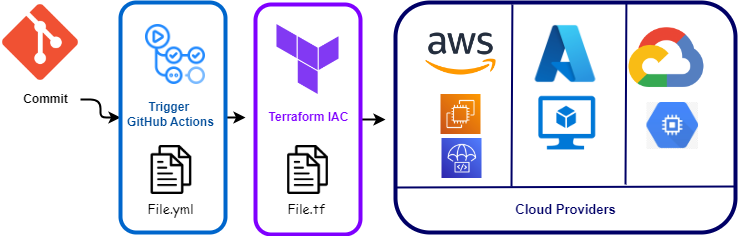

# DevOps Challenge

## Descrição

**IPipeline CI/CD Automatizada AWS Azure e Google Cloud Platform (GCP)**

A integração multicloud aumenta a resiliência e disponibilidade do sistema, permitindo atualizações rápidas e eficientes em AWS, Azure e GCP.

**AWS:**
  - Uma instância EC2 será provisionada e gerenciada via Terraform.
  - Deploy automatizado usando AWS CodeDeploy.
  - CodePipeline integrará o repositório GitHub com CodeDeploy, coordenando o fluxo de entrega contínua.

**Azure:**
  - Uma VM será provisionada e gerenciada via Terraform.
  - Deploy automatizado usando  GitHub Actions, com scripts para instalação e atualização da aplicação.

**GCP:**
- Uma VM será provisionada e gerenciada via Terraform.
- Deploy automatizado usando Google Cloud Build ou GitHub Actions, com scripts para instalação e atualização da aplicação.

### Tecnologias Utilizadas
 
- Github
- GitHub Actions
- AWS
- AZURE
- GCP
- Terraform
- CodeDeploy
- SSM Agent
- CodePipeline

## Diagrama da Solução

  

## Instruções

## 1 - INSTRUÇÕES PIPELINE AWS

**PROVEDOR AWS**

  workflow configura e aplica a infraestrutura na AWS utilizando Terraform

  

  Irá conter arquivos:

  - 1   -aws-apply.yml    - Fará o Deploy da Infraestrutura
  - 1.1 -aws-install.yml  - instalara as configurações servidor
  - 1.2 -aws-deploy.yml   - realizara o deploy no servidor
  - 1.3 -aws-destroy.yml  - ira desfazer toda a infraestrtura

**1. Para começar, é essencial ter acesso à plataforma AWS para gerenciar seus recursos na nuvem de forma eficiente.**

**2. Crie um usuário na AWS e gere "Secret Keys" para acesso seguro aos recursos AWS via linha de comando. É recomendado não compartilhar essas "Secret Keys" para manter a segurança dos seus dados.**

    - Selecione as políticas apropriadas, como AmazonEC2FullAccess, AmazonVPCFullAccess, AmazonCodeDeployFullAccess ou crie uma política personalizada com as permissões necessárias para seu projeto.

**3.Criar um Bucket que servirá como um backend e armazenara o arquivo terraform.state gerado**
  

  
  
**4. No repositorio Certifique-se de que os secrets estão corretamente configurados no seu repositório GitHub:**

 - **AWS_ACCESS_KEY_ID  / AWS_SECRET_ACCESS_KEY**  - Chaves programaticas geradas na console na etapa incial.
 - **AWS_BUCKET_NAME** - Nome do bucket criado na console , para gerenciar o estado do terraform.
 - **AWS_BUCKET_FILE** - Nome do arquivo gerado pelo terraform (ex: terraform.tfstate).

**5. Configurar as variaveis para o Deploy na infraestrutra no arquivo ./src/aws/variables.tf**

  

  - Observação : Por questões de segurança e recomendado criar a chave .pem na propria console da AWS e apenas referenciar o nome da chave no campo **variable "key_pair"**.

**6 - Criação CodePipeline:**

  - Nesta etapa iremos criar o CodePipeline , para realizar a integração do Repositorio juntamente ao CodeDeploy.

  - Observação: A criação da ferramenta será via console , poís será preciso realizar autenticação juntamente ao GitHub.

  ir em Code Pipeline > criar Pipeline.

  

  Adicionar repositorio , precisara autenticar ao github  .

  

  No acionador manter essas configurações.

  

  Ignorar etapa de compilação.

  

  Etapa de implantação , selecionar o CodeDeploy como provedor , Nome do aplicativo eo Grupo de implantação.

  

  Proximo , revisar e criar pipeline  .  

**7. Acionar a Pipeline**

  - **Observação:** Primeiramente garantir se todas as etapas de configuração acima foram executadas e revisadas.

  - Preparar o disparo do GitHub Actions (Trigger)
  - Descomentar o bloco abaixo que esta presente em .github/workflows/1.1-aws-deploy.yml e salvar.

  - Realizar um Push no repositorio a partir de alguma alteração , piepeline será disparada

## 1 - INSTRUÇÕES PIPELINE AZURE

**PROVEDOR AZURE**

  workflow configura e aplica a infraestrutura na AZURE utilizando Terraform

  Irá conter arquivos:

    

  - 2-azure-cd.yml    - Fará o Deploy da Infraestrutura e configurações no servidor

**1. Para começar, é essencial ter acesso à plataforma AZURE para gerenciar seus recursos na nuvem de forma eficiente.**

**2. Seguir o passo a passo conforme a documentação oficial da Microsoft para criação das credenciais e assinatura**

<a href="https://learn.microsoft.com/en-us/azure/developer/github/connect-from-azure?tabs=azure-cli%2Clinux#use-the-azure-login-action-with-openid-connect">Conectando Github Actions na Azure</a>

<a href="https://learn.microsoft.com/en-us/devops/deliver/iac-github-actions#architecturet">Criando as credeneciais </a>

**3. No repositorio Certifique-se de que os secrets estão corretamente configurados no seu repositório GitHub:**

 - **AZURE_CLIENT_ID  / AZURE_CLIENT_ID**  - Chaves programaticas geradas na console na etapa incial.
 - **AZURE_SUBSCRIPTION_ID** - ID da assinatura

**4. Configurar as variaveis para o Deploy na infraestrutra no arquivo ./src/azure/variables.tf**

  

**5. Acionar a Pipeline**

  - **Observação:** Primeiramente garantir se todas as etapas de configuração acima foram executadas e revisadas.

  - Preparar o disparo do GitHub Actions (Trigger)
  - Descomentar o bloco abaixo que esta presente em .github/workflows/1.1-aws-deploy.yml e salvar.

  - Realizar um Push no repositorio a partir de alguma alteração , piepeline será disparada  

## 1 - INSTRUÇÕES PIPELINE GCP

**PROVEDOR GCP**

  workflow configura e aplica a infraestrutura na AZURE utilizando Terraform

  Irá conter arquivos:

    

  - 3-gcp-cd.yml    - Fará o Deploy da Infraestrutura e configurações no servidor  

**1. Para começar, é essencial ter acesso à plataforma AZURE para gerenciar seus recursos na nuvem de forma eficiente.**  

**2. Obter o GOOGLE_PROJECT_ID**

1. O GOOGLE_PROJECT_ID é o identificador único do seu projeto na GCP. Para obtê-lo:

- Acesse o Console do Google Cloud No menu de navegação, clique em "Select a project" (Selecionar um projeto).
- Encontre o seu projeto na lista e copie o Project ID (ID do projeto).

2. Criar e Obter as Credenciais de Serviço (GOOGLE_CREDENTIALS)
Para criar e obter um arquivo de chave JSON para as credenciais de serviço:

3. No Console do Google Cloud, vá para "IAM & Admin" > "Service Accounts" (Contas de Serviço) clicar em Criar Conta de Serviço.

- Preencha o nome da conta de serviço e, opcionalmente, uma descrição. Clique em "Create" (Criar).
- Na seção "Service account permissions" (Permissões da conta de serviço), atribua as permissões necessárias para a conta de serviço. Isso geralmente será algo como "Editor" ou qualquer outro papel que você precisar. Clique em "Continue" (Continuar).
- Na seção "Grant users access to this service account" (Conceder acesso a esta conta de serviço), você pode pular este passo. Clique em "Done" (Concluído).
- Na lista de contas de serviço, encontre a conta de serviço que você acabou de criar. Clique no botão de menu (três pontos) na extremidade direita da linha e selecione "Create key" (Criar chave).
- Escolha o formato de chave como JSON e clique em "Create" (Criar). O arquivo JSON será baixado automaticamente.

**4. No repositorio Certifique-se de que os secrets estão corretamente configurados no seu repositório GitHub:**

 - **GOOGLE_PROJECT_ID / GOOGLE_CREDENTIALS**  - Chaves programaticas geradas na console na etapa incial.

**5. Configurar as variaveis para o Deploy na infraestrutra no arquivo ./src/gcp/variable.tf**

  

**6. Acionar a Pipeline**

  - **Observação:** Primeiramente garantir se todas as etapas de configuração acima foram executadas e revisadas.

  - Preparar o disparo do GitHub Actions (Trigger)
  - Descomentar o bloco abaixo que esta presente em .github/workflows/1.1-aws-deploy.yml e salvar.

  - Realizar um Push no repositorio a partir de alguma alteração , piepeline será disparada   

>  This is a challenge by [Coodesh](https://coodesh.com/)

